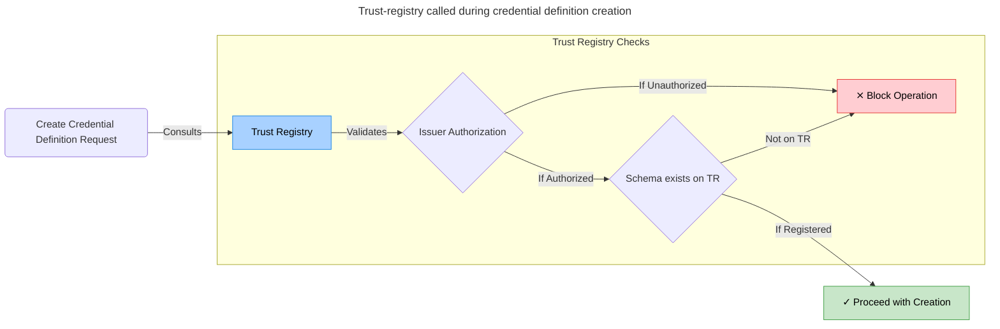
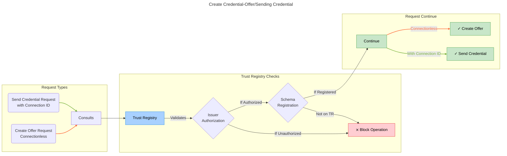
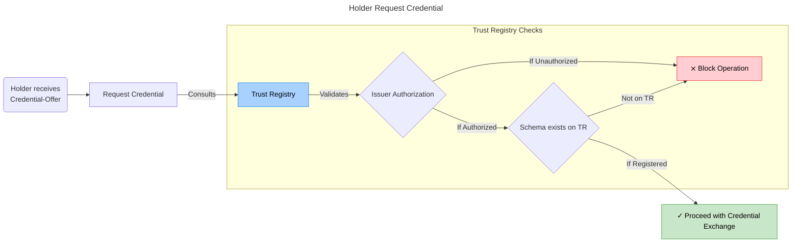
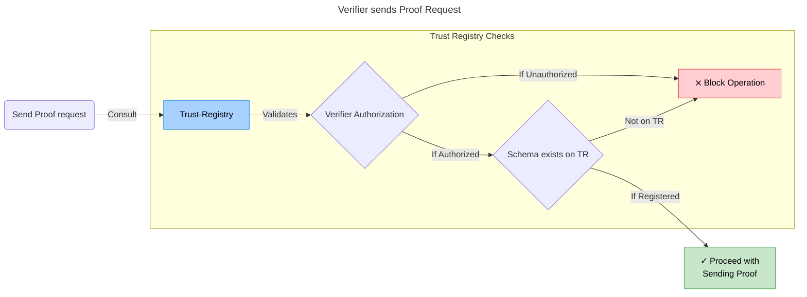
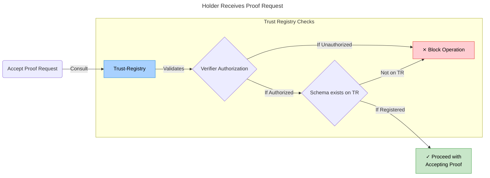

# Trust Registry

As a client, you can retrieve the trust registry but not alter it. This design is intentional as only administrative
actions should modify the trust registry, and such actions are only possible with an admin role.

> NOTE: The Trust Registry GET API endpoint is not protected and should not be publicly accessible.

The [Trust Registry](http://trust-registry.cloudapi.127.0.0.1.nip.io/docs) serves
as a gatekeeper interface for interactions, maintaining the truth states about
actors, their respective roles as issuers and/or verifiers, and schemas.

The [Swagger docs](http://trust-registry.cloudapi.127.0.0.1.nip.io/docs) are
divided into three main sections:

- Actor - For actor information and actions on the ledger
- Schema - For schema information and actions on the ledger
- Default - To retrieve all information from the registry

The trust registry provides access to this data via `actors` and `schemas` keys, which can be found in the JSON blob
retrieved from requesting the endpoint. Their structures are as follows:

```json
{
    "actors": [
    {
      "name": "Test Actor-0.26703024264670694",
      "roles": [
        "issuer",
        "verifier"
      ],
      "did": "did:sov:XfbLjZFxgoznN24LUVxaQH",
      "id": "test-actor-0.26703024264670694",
      "didcomm_invitation": null,
      "image_url": "https://upload.wikimedia.org/wikipedia/commons/7/70/Example.png"
    },
    ...
}
```

The fields here should be self-explanatory.

And,

```json
{
    "schemas": [
        "z5Bug71M7Sj7cYpbVBDmN:2:test_schema:0.3",
        "MnspmfkzjLXd6WXyjCYJKW:2:test_schema:0.3",
        "E2HWvrZYs9SCXXHCZtFV1U:2:test_schema:0.3",
        ...
    ]
}
```

where `"z5Bug71M7Sj7cYpbVBDmN:2:test_schema:0.3"` represents the schema ID, name, and version respectively.

> **_NOTE_**: In a production environment, this should not be exposed to the internet or interacted with directly.
> It's advisable to either avoid exposing this to the internet or set up a separate security layer for the trust
> registry. This is because it's crucial to prevent unauthorized individuals from making changes to the trust registry.

## Trust-registry Role in the application flows

Below we indicate where and how the Trust-registry is consulted to verify that Issuers/Verifiers and schemas are on the
Trust-registry.

### Create Credential Definition



---

### Credential issuance



---



---

### Proof Requests



---



---
