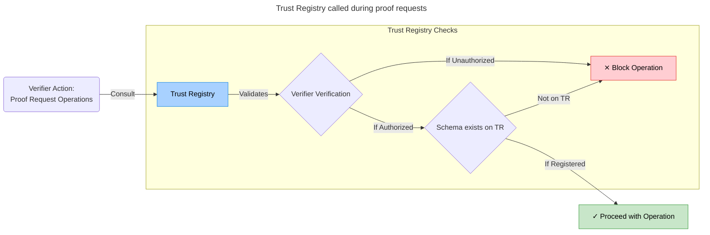

# Trust Registry

As a client, you can retrieve the trust registry but not alter it. This design is intentional as only administrative
actions should modify the trust registry, and such actions are only possible with an admin role.

> NOTE: The Trust Registry GET API endpoint is not protected and should not be publicly accessible.

The [Trust Registry](http://trust-registry.cloudapi.127.0.0.1.nip.io/docs) serves
as a gatekeeper interface for interactions, maintaining the truth states about
actors, their respective roles as issuers and/or verifiers, and schemas.

The [Swagger docs](http://trust-registry.cloudapi.127.0.0.1.nip.io/docs) are
divided into three main sections:

- Actor - For actor information and actions on the ledger
- Schema - For schema information and actions on the ledger
- Default - To retrieve all information from the registry

The trust registry provides access to this data via `actors` and `schemas` keys, which can be found in the JSON blob
retrieved from requesting the endpoint. Their structures are as follows:

```json
{
    "actors": [
    {
      "name": "Test Actor-0.26703024264670694",
      "roles": [
        "issuer",
        "verifier"
      ],
      "did": "did:sov:XfbLjZFxgoznN24LUVxaQH",
      "id": "test-actor-0.26703024264670694",
      "didcomm_invitation": null,
      "image_url": "https://upload.wikimedia.org/wikipedia/commons/7/70/Example.png"
    },
    ...
}
```

The fields here should be self-explanatory.

And,

```json
{
    "schemas": [
        "z5Bug71M7Sj7cYpbVBDmN:2:test_schema:0.3",
        "MnspmfkzjLXd6WXyjCYJKW:2:test_schema:0.3",
        "E2HWvrZYs9SCXXHCZtFV1U:2:test_schema:0.3",
        ...
    ]
}
```

where `"z5Bug71M7Sj7cYpbVBDmN:2:test_schema:0.3"` represents the schema ID, name, and version respectively.

> **_NOTE_**: In a production environment, this should not be exposed to the internet or interacted with directly.
> It's advisable to either avoid exposing this to the internet or set up a separate security layer for the trust
> registry. This is because it's crucial to prevent unauthorized individuals from making changes to the trust registry.

## Trust Registry Interactions

Below, we outline where and how the Trust Registry is consulted to verify that Issuers, Verifiers, and Schemas are
compliant.

### Issuer Actions

When a user/tenant initiates any issuer-related action, the Trust Registry is used to verify the following:

1. Issuer Verification:
   - For **creating credential definitions**, **creating credential offers**, and **issuing credentials**:
     Confirms that the tenant is registered with the role of an issuer.
   - For **accepting credentials**: Confirms that the tenant is receiving a credential from a registered issuer.
2. Schema Validation: Ensures that the referenced schema is valid and registered within the Trust Registry.

If either step fails, the operation is blocked, and an appropriate error message is returned to the user.
The operation is logged and able to be reviewed by an administrator.


---

### Verifier Actions

When a tenant initiates any verifier-related action (sending proof requests or receiving proof presentations),
the Trust Registry is used to verify the following:

1. Verifier Verification:
   - For **sending proof requests**: Confirms that the tenant sending the request is registered as a verifier.
   - For **accepting proof requests**: Validates that the proof is being presented to a registered verifier.
2. Schema Validation: Ensures that the attributes being requested are associated with schemas registered
   within the Trust Registry.

If either step fails, the operation is blocked as a bad request, with an appropriate error message returned to the user.


