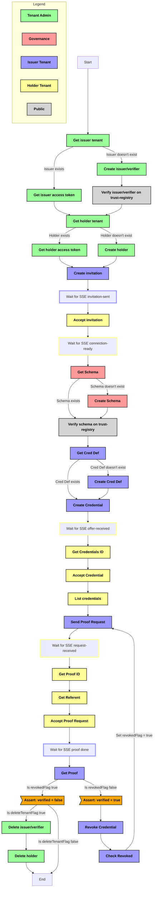

```mermaid
graph TD
 %% Define styles for different actors with improved contrast
 classDef tenantAdmin fill:#99ff99,stroke:#333,stroke-width:2px,color:#000000,font-weight:bold;
 classDef governance fill:#ff9999,stroke:#333,stroke-width:2px,color:#000000,font-weight:bold;
 classDef issuerTenant fill:#9999ff,stroke:#333,stroke-width:2px,color:#000000,font-weight:bold;
 classDef holderTenant fill:#ffff99,stroke:#333,stroke-width:2px,color:#000000,font-weight:bold;
 classDef publicEndpoint fill:#d3d3d3,stroke:#333,stroke-width:2px,color:#000000,font-weight:bold;
 classDef assertion fill:#ffa500,stroke:#333,stroke-width:2px,color:#000000,font-weight:bold;
 %% Define styles for SSE steps
 classDef sseIssuer stroke:#9999ff,stroke-width:4px,color:#1;
 classDef sseHolder stroke:#ffff99,stroke-width:4px,color:#1;
 %% Start and End
 A[Start]
 AG[End]
 %% Tenant Admin actions
 B[Get issuer tenant]:::tenantAdmin
 C[Get issuer access token]:::tenantAdmin
 D[Create issuer/verifier]:::tenantAdmin
 F[Get holder tenant]:::tenantAdmin
 G[Get holder access token]:::tenantAdmin
 H[Create holder]:::tenantAdmin
 AE[Delete issuer/verifier]:::tenantAdmin
 AF[Delete holder]:::tenantAdmin
 %% Governance actions
 L[Get Schema]:::governance
 M[Create Schema]:::governance
 %% Public actions
 E[Verify issuer/verifier on trust-registry]:::publicEndpoint
 N[Verify schema on trust-registry]:::publicEndpoint
 %% Issuer Tenant actions
 I[Create invitation]:::issuerTenant
 O[Get Cred Def]:::issuerTenant
 P[Create Cred Def]:::issuerTenant
 Q[Create Credential]:::issuerTenant
 U[List credentials]:::holderTenant
 V[Send Proof Request]:::issuerTenant
 AB[Get Proof]:::issuerTenant
 AC[Revoke Credential]:::issuerTenant
 AD[Check Revoked]:::issuerTenant
 %% Holder Tenant actions
 J[Accept invitation]:::holderTenant
 R[Wait for SSE offer-received]:::sseHolder
 S[Get Credentials ID]:::holderTenant
 T[Accept Credential]:::holderTenant
 W[Wait for SSE request-received]:::sseHolder
 X[Get Proof ID]:::holderTenant
 Y[Get Referent]:::holderTenant
 Z[Accept Proof Request]:::holderTenant
 %% Shared or system actions
 K[Wait for SSE connection-ready]:::sseHolder
 AA[Wait for SSE proof done]:::sseIssuer
 invitationSent[Wait for SSE invitation-sent]:::sseIssuer
 %% Assertions
 AJ>Assert: verified = true]:::assertion
 AK>Assert: verified = false]:::assertion
 %% Flow
 A --> B
 B -->|Issuer exists| C
 B -->|Issuer doesn't exist| D --> E --> F
 C --> F
 F -->|Holder exists| G
 F -->|Holder doesn't exist| H --> I
 G --> I --> invitationSent --> J --> K --> L
 L -->|Schema exists| N
 L -->|Schema doesn't exist| M --> N
 N --> O
 O -->|Cred Def exists| Q
 O -->|Cred Def doesn't exist| P --> Q
 Q --> R --> S --> T --> U
 U --> V --> W --> X --> Y --> Z --> AA --> AB
 AB -->|Is revokedFlag true| AK
 AB -->|Is revokedFlag false| AJ
 AJ --> AC --> AD -->|Set revokedFlag = true| V
 AK -->|Is deleteTenantFlag true| AE --> AF --> AG
 AK -->|Is deleteTenantFlag false| AG
 %% Legend
 subgraph Legend
 TA[Tenant Admin]:::tenantAdmin
 GOV[Governance]:::governance
 IT[Issuer Tenant]:::issuerTenant
 HT[Holder Tenant]:::holderTenant
 PE[Public]:::publicEndpoint
 end
```
